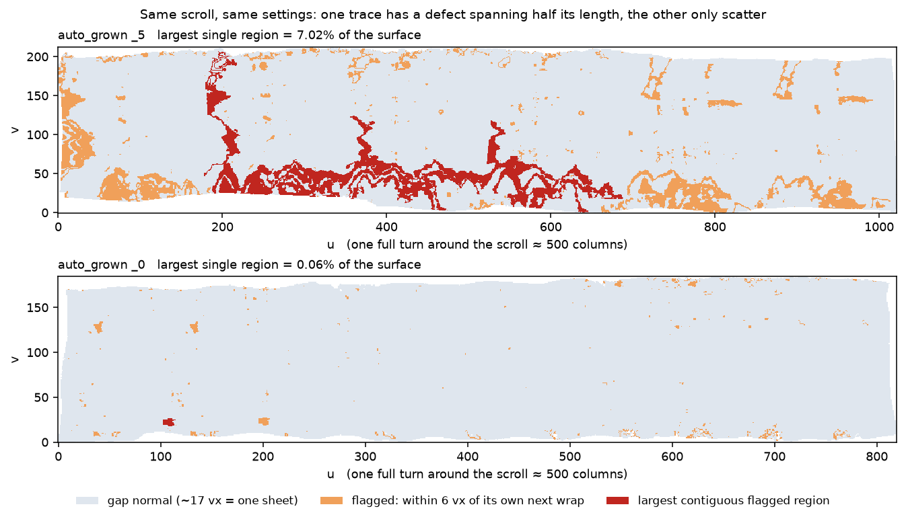
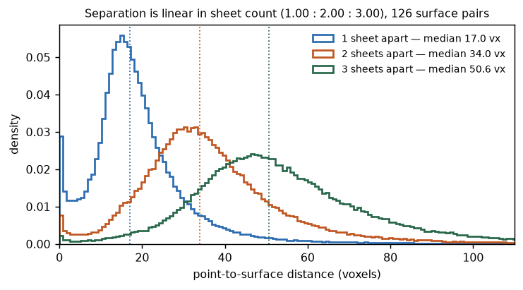
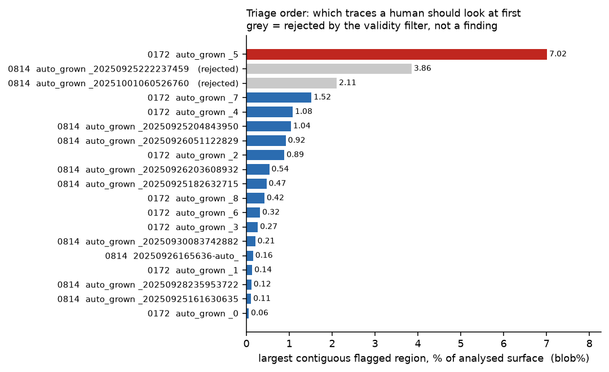

# windcheck

Cross-wrap consistency checking for Herculaneum scroll segmentations.

`windcheck` reads published `tifxyz` surfaces and reports where a traced sheet,
after one full revolution around the scroll, lands back on the wrap it just
traced instead of advancing to the next one. Input is a `tifxyz` directory (or a
tree of segments); output is a per-trace table plus JSON. The method is
point-to-surface distance from each grid point to the nearest part of the same
surface at least *N* columns away in `u`. It needs no labels, no ground truth, no
model and no volume download, and it is CPU-only.



Same scroll, same settings. The upper trace has a single flagged region covering
**7.02%** of its surface and spanning roughly half its length; the lower one has
only scatter. Distinguishing these is what the tool is for.

### Why it is useful

- **It works where supervised methods can't.** There is no published set of
  known-bad segments, so nothing can be trained or scored against ground truth.
  This is derived instead from a property a correct trace must satisfy, so it
  needs no labels at all.
- **It carries controls that fire.** 44 labelled single-wrap segments return
  0.00% — a segment with no previous wrap must produce nothing, and does. The
  validity filter rejected the two *highest-scoring* traces in the sample as
  artifacts. A check that discards its own best-looking results is one whose
  surviving results mean something.
- **The measurement is verifiable.** Sheet separation comes out linear in sheet
  count to three decimals (1.000 : 2.003 : 3.004 over 126 surface pairs), and
  the geometric kernel agrees with exhaustive search to 3.6e-6 voxels.
- **It's cheap.** A few minutes per scroll on a laptop. No GPU, no volume
  download, no per-scroll training — calibrate, then run.
- **Nothing else does this.** A search of the `volume-cartographer` tree finds
  no self-contact, injectivity or fold check anywhere on the mesh
  representation; the one relevant parameter,
  `resume_local_row_self_intersection_cell_factor`, has **no consumer in the
  codebase**. The naive alternative — nearest-*sample* distance — cannot work
  here: grids are sampled every ~20 voxels while sheets sit ~17 apart, so it
  cannot even separate a one-sheet gap from a two-sheet gap.
- **Detection is measured, not asserted.** On defects planted in a clean trace,
  it localises them at **0.96 precision** and up to **0.89 recall**, against a
  0.86% false-positive baseline — under a gate written before the run. Recall
  degrades smoothly (0.80 → 0.48) as the planted defect stops being a clean
  copy, with precision holding above 0.83 throughout, consistently across three
  host traces. Reproduce with `uv run python bench/inject_benchmark.py` and
  `bench/difficulty_sweep.py`.

It reports **geometry and a ranking**, not a verdict: which trace a human should
open first. See [docs/submission.pdf](docs/submission.pdf) §6 for exactly what
is and is not established.

---

## What you get

One command, three subcommands.

| | |
|---|---|
| `windcheck selfgap` | **The normal entry point.** Runs the check over every surface under a path and prints a table: fraction of points inside the 2.0-voxel same-surface threshold, fraction inside the wider 6.0-voxel flag, largest contiguous flagged region (raw and normalised), concentration, and a validity verdict per trace. |
| `windcheck calibrate` | Re-derives the sheet-separation table from labelled `wNNN` segments — what one, two and three sheets of separation actually measure, in voxels, on the scroll being checked. Run this before trusting any threshold on new data. |
| `windcheck status` | Summarises a sample's published corpus: labelled windings, `auto_grown` traces, whether the winding run is contiguous. |

## Building

Needs Python 3.11–3.13, a C++17 compiler, and [uv](https://docs.astral.sh/uv/).

```sh
uv sync
clang++ -O3 -std=c++17 -pthread -o engines/atlas_query engines/atlas_query.cpp
uv run pytest -q            # 5 tests, no data required
```

GCC works in place of `clang++`. `-pthread` is required: the engine uses a
`std::thread` pool, not OpenMP. The engine is the only compiled component.

## Input format

A `tifxyz` surface is a directory containing:

```
x.tif  y.tif  z.tif     float32, identical shape (v, u)
meta.json               carries "scale" and "bbox"
```

The three images are a 2D grid of 3D vertex coordinates: grid index `(v,u)` maps
to a volume coordinate `(x,y,z)`. Walking along `u` goes around the scroll.
Missing cells are marked by setting all three coordinates to `-1`, or via an
optional `mask.tif` sidecar; both are honoured.

Both published layouts in the open-data bucket are found automatically:

```
<segment>/mesh/<id>-on-<volume>-<res>.tifxyz/
<segment>/mesh/intermediate/tifxyz_original/
```

Fetch a scroll's surfaces (~670 MB for `PHerc0172`):

```sh
uv run python -m windcheck.fetch --sample PHerc0172
uv run python -m windcheck.fetch --verify      # re-check against the manifest
```

This writes `data/scroll5_tifxyz/` and `data/MANIFEST.json`, which pins every
file by S3 key, byte count and SHA-256.

## Usage

### 1. Check every trace in a scroll — the usual case

```sh
uv run windcheck selfgap data/scroll5_tifxyz --json report.json
```

Surfaces too small to contain a previous wrap are skipped and counted, not
reported as zero.

| option | meaning |
|---|---|
| `--stride N` | grid subsampling (default 3). Lower is slower and finer; results are stable from 2 to 6. |
| `--exclude-u N` | columns excluded either side of each query's own `u` (default 60). Must be well below one revolution in `u` and well above the local surface width. |
| `--json PATH` | also write the table as JSON |

### 2. Calibrate before trusting the thresholds

```sh
uv run windcheck calibrate data/scroll5_tifxyz
```



On `PHerc0172` this gives **17.05 / 34.14 / 51.22** voxels over 126 surface
pairs — ratios **1.000 / 2.003 / 3.004**. That linearity is what licenses
reading a doubled gap as a skipped wrap. If it is not linear on your scroll, the
labels are not a radial index and the check does not apply.

Note the overlap between distributions: per-*point* discrimination between a
one- and two-sheet gap is only about 78%, which is why verdicts are per region
and never per point.

Options: `--max-k` (default 3), `--stride` (default 8), `--max-dist` (default
200, ignores pairs where the two sheets do not overlap), `--threads`.

### 3. A single surface

```sh
uv run windcheck selfgap path/to/one.tifxyz
```

## Output

| column | meaning |
|---|---|
| `trace` | segment name |
| `u` | u-extent of the grid — how far around the scroll it goes |
| `<2.0vx` | % of points within 2.0 voxels of the trace's own next wrap. 2.0 is volume-cartographer's `same_surface_th` (`core/src/GrowSurface.cpp`), the distance at which its segment grower rejects a candidate for landing on already-traced surface. |
| `flag%` | % within the wider 6.0-voxel flag, used for clustering |
| `blob` | largest contiguous flagged region, in grid cells |
| `blob%` | that region as a fraction of analysed points — **use this** for any comparison between traces. Raw cell counts scale with trace size and with `--stride`. |
| `top5` | share of flagged points in the five largest regions. High = concentrated, low = scattered. |
| `du p10` | 10th percentile of \|u_partner − u_query\| over flagged points. Should sit near one revolution. |
| `valid` | `OK`, or `REJECT` with a reason |

**`REJECT` is not a defect finding.** It means the row cannot be trusted: the
flagged partners sit too close to the exclusion cutoff, so they may be same-wrap
neighbours rather than the next wrap. Rows are rejected in code, not by
inspection.

**Scattered flagging at a few percent appears on every scroll checked so far**
and is not by itself informative. Concentration is what separates traces:



JSON output carries the same fields plus coverage, median gap, 4-connectivity
component size, and the rejection reason.

## Use as a library

Everything the CLI does is available directly. `analyse` returns a dataclass; the
JSON output is the same fields.

```python
from windcheck import selfgap

r = selfgap.analyse("path/to/segment.tifxyz", exclude_u="auto")
if r and r.valid and r.blob_fraction > 0.02:
    print(f"{r.name}: {r.blob_fraction:.2%} of the surface in one region")
```

| field | type | meaning |
|---|---|---|
| `name`, `u_extent`, `n_points`, `coverage` | str, int, int, float | identity and how much was analysed |
| `median_gap` | float | median distance to the next wrap, voxels |
| `frac_below_grower_th`, `frac_flagged` | float | inside 2.0 vx and 6.0 vx |
| `largest_blob`, `blob_fraction`, `largest_blob_4c`, `top5_share` | int, float, int, float | concentration (zero for OBJ input — see below) |
| `du_p10`, `du_median` | float | where flagged partners sit, in u |
| `valid`, `reason` | bool, str | the validity verdict |

Lower layers are usable on their own: `windcheck.tifxyz.read` and
`windcheck.objmesh.read` return surfaces and meshes, `windcheck.atlas` writes the
engine's binary formats, and `windcheck.inject` plants defects for benchmarking.

## Input formats

| format | self-gap | concentration stats |
|---|---|---|
| `tifxyz` (VC3D grid) | yes | yes |
| `.obj` **with** `vt` parametrisation | yes | no — a triangle soup has no grid to label components on |
| `.obj` **without** `vt` | no — refused rather than guessed | no |

The same trace measured in both published formats agrees closely: `<2.0vx` of
**6.60%** from the tifxyz and **6.54%** from the 415 MB OBJ, with `exclude_u`
chosen automatically in each (129 grid columns vs 28 parameter units). Two
parsers, one kernel, one answer.

## Performance

The engine sustains roughly **27,000 point-to-surface queries per second on 12
threads** against a 30-million-triangle atlas. A full scroll of 53 surfaces
checks in a few minutes on a laptop.

Distance is measured to the interpolated surface, not to the nearest grid
sample. This matters: the grids are sampled roughly every 20 voxels while
adjacent sheets sit about 17 voxels apart, so a nearest-sample method cannot
separate one sheet of gap from two.

## Layout

```
engines/atlas_query.cpp   point-to-surface distance kernel (C++17)
src/windcheck/
  tifxyz.py               reader, written from the format spec
  atlas.py                surface assembly, binary bridge to the engine
  selfgap.py              the check and the validity filter
  catalog.py, fetch.py    open-data catalog, download, SHA-256 manifest
  ct_check.py             CT cross-referencing helpers
  cli.py                  command line
tests/                    engine vs brute force, search-radius certification,
                          true separation vs grid pitch, the null control,
                          missing-cell handling
sample_outputs/           real runs against PHerc0172 and PHerc0814
```

`tifxyz.py` deliberately does not use the upstream `vesuvius` package. This tool
checks that pipeline's output, so it must be able to disagree with it.

## Licence

MIT. See [LICENSE](LICENSE).
