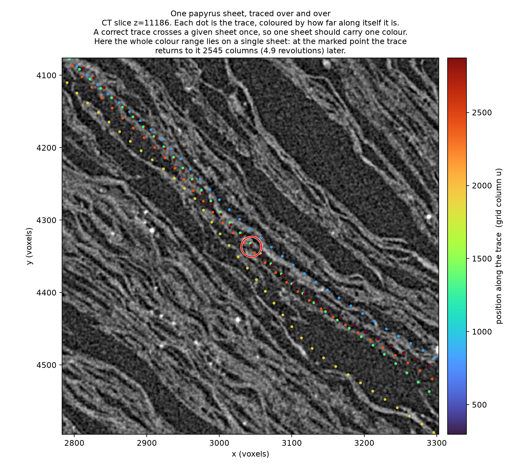

# windcheck

**A deterministic self-intersection validator for traced Herculaneum surfaces**,
with corpus-scale measurements of a geometry associated with sheet switches that
return.

Vesuvius Challenge names *sheet switching* — *"meshes can jump from one wrap to
another"* — among its current open problems, and notes that *"automatic growth
still needs human inspection and correction."* A trace that switches wraps and
later returns meets itself, which this measures exactly. A switch that never
returns need not self-intersect, so this is **not** a complete sheet-switch
detector, and a crossing is not proof that a switch occurred.

The method: a traced sheet cannot pass *through* itself. Wherever a published
`tifxyz` surface does, that is a defect in the representation — and unlike
proximity, saying so needs no threshold, because it does not depend on how
tightly the scroll is packed. A trace that switches wraps and later returns meets
itself a full wrap or more away, which is directly measurable.

Across **179 published segments from five scrolls** — Scroll 1, Scroll 5,
PHerc0139, PHerc0814, PHerc1667, 228 million triangles — **160 contain at least
one transverse self-intersection.**



*One CT slice through Scroll 5. Each dot is the trace, coloured by how far along
itself it is. A correct trace crosses a given sheet once, so one sheet should
carry one colour — here the whole range lies on a single sheet, and at the marked
point the trace returns to it 2,545 columns (4.9 revolutions) later.*

## Results for every segment, precomputed

You do not need to download 18 GB to look up your own trace.
[`results/index.json`](results/index.json) has all 179 segments with their
band and verdict, and [`results/certificates/`](results/certificates) has the
certificate and VC3D overlay for each — 38 wrap-scale,
63 one-revolution, 59 local, 19 with no
crossing found.

Read [`docs/submission.md`](docs/submission.md) for the full result and
[`docs/REPRODUCE.md`](docs/REPRODUCE.md) to rerun it. The whole audit takes
**91 seconds** once the data is local.

> **Note on earlier versions of this tool.** windcheck previously measured
> *proximity* — how close a trace comes to another part of itself. Two
> volume-cartographer maintainers pointed out that this is undecidable, since
> wraps in a crushed scroll genuinely lie microns apart and a 20 vx quad mesh can
> interpolate to closer positions than its samples support. They were right. The
> tool now measures transverse self-intersection instead, which the packing
> objection cannot touch. See `docs/submission.md` §2.

---

## Quick start

```sh
uv sync --extra viz
clang++ -O3 -std=c++17 -pthread -o engines/selfcross   engines/selfcross.cpp
clang++ -O3 -std=c++17 -pthread -o engines/atlas_query engines/atlas_query.cpp
uv run pytest -q                                  # 21 tests, no data needed

# check one surface -- this is the whole tool
uv run windcheck check path/to/segment
```

```
20251115002745-auto_grown_20251115002740308_5_flatboi
  grid                637 x 3065      triangles  3,535,554
  covering span       5.91 revolutions
  widest separation   4.91 revolutions    ->  wrap-scale
  crossing events     563   (379 beyond the wrap-scale cut)
  VERDICT             wrap-scale self-overlap present

  certificate  out/check/..._certificate.json
  overlay      out/check/..._points.json   <- open in VC3D (379 points)
```

`bench/` reproduces every figure in the write-up; you do not need it to use the
tool.

No GPU. No labels, no ground truth, no model. The core measurement reads only
the published surface meshes — no volume download at all.

## What you get

A **certificate** per trace, in physical and revolution units, carrying its own
caveats and enough provenance to reproduce it.

An **overlay** in volume-cartographer's own `PointCollections` JSON schema, so it
opens in the existing point-collection widget with no transform — one point per
crossing *event*, not per triangle pair.

```json
"measurements": {
  "total_area_mm2": 43952.5,
  "separation_revolutions": 4.908,
  "covering_span_revolutions": 5.91,
  "crossing_events": 563,
  "events_beyond_cut": 379
},
"verdict": "wrap-scale self-overlap present"
```

## What the number means

Three facts are reported separately, and none of them asserts a cause.

| field | values |
|---|---|
| `crossing_status` | `none` · `present` |
| `separation_revolutions` | a continuous distance along the trace's own parameter |
| `period_status` | `agreed` · `disagreed` · `unavailable` |

Separation is a distance divided by an estimated revolution period. Two
independent estimators of that period are computed; when they disagree the ratio
is not interpretable, and the segment is reported as intersecting with the scale
**unavailable** rather than being placed in a band.

Across the 179 audited segments:

```
  crossing        present 160    none 19
  period          agreed   96    disagreed 38    unavailable 45
  separation      < 0.15 rev  59    0.15-1.6 rev  63    >= 1.6 rev  38
```

Of the 38 with a separation of 1.6 revolutions or more, **34 have an agreed
period**; the other four are reported without a scale.

An earlier version of this tool sorted segments into "local", "one revolution"
and "wrap-scale". That was dropped: adding a fifth scroll closed the gap between
the upper two, so the three-way split was an artifact of the four corpora it came
from, and the last label implied a cause that was never established. Filters over
separation remain, labelled literally.

## How far to trust it

- Agrees with **FCL** in both directions: 250/250 on positives, 249/250 on
  negatives, the single disagreement explained.
- Counts are **deterministic** across thread counts and broad-phase cell sizes,
  pinned by regression tests.
- The revolution period is checked against **published winding counts**: on 31 of
  33 Scroll 1 segments named by winding range, r = 0.9999, mean absolute error
  0.033 windings.
- Its span is invariant to **0.3%** across a 70× change in sampling density, and
  ~90% of intersections survive **every** choice of quad diagonal.

**It does not show that a crossing is a tracing error.** It shows the surface
overlaps itself. Three attempts to connect the two failed and are documented in
`docs/submission.md` §9, along with everything else this does not establish.

## Licence

MIT. See `LICENSE`.
