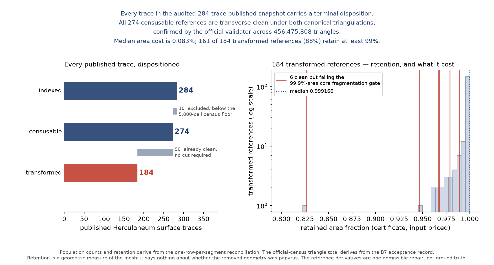
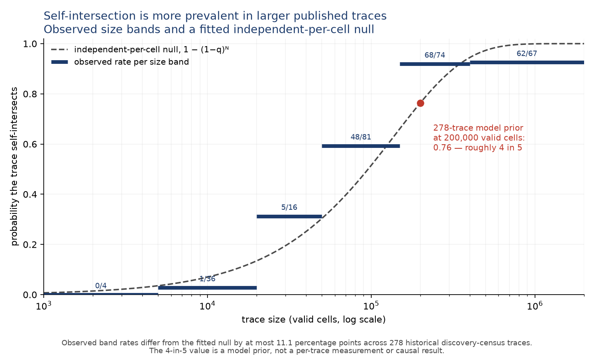
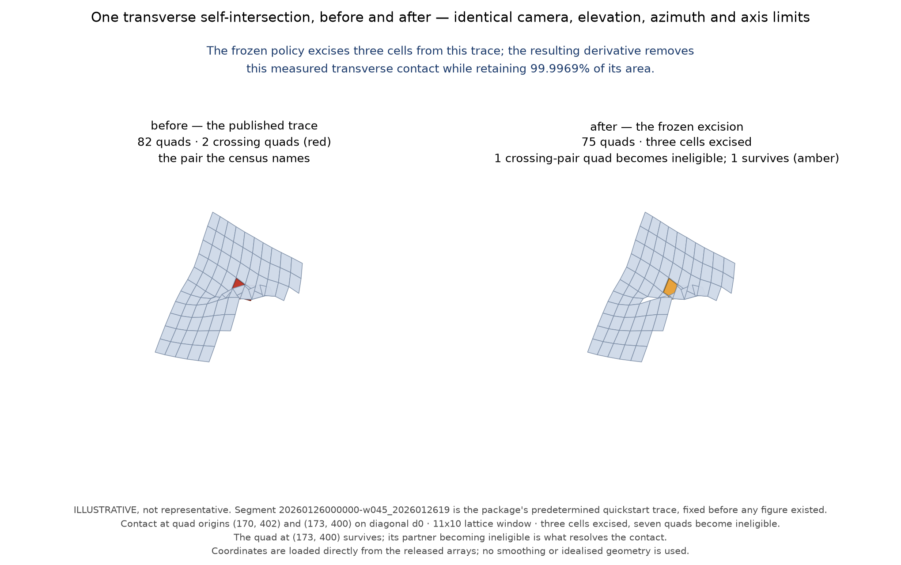
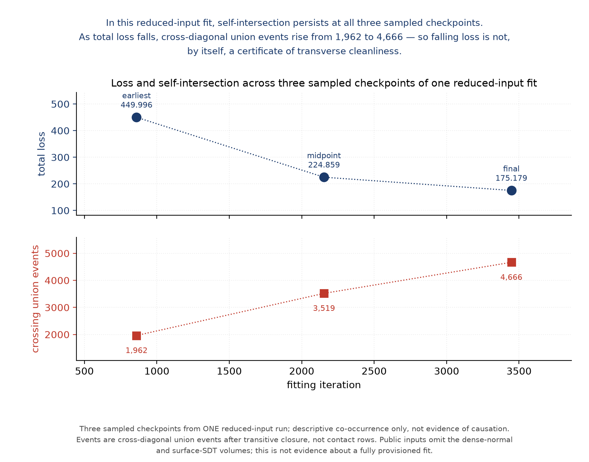

# Every published Herculaneum surface trace, dispositioned for self-intersection

*274 censusable cases with transverse-clean references; 10 below-floor
exclusions, named.*

Windcheck — *self-intersection checks for Herculaneum surface traces.*
Prepared by Josep for the 30 September 2026 progress prize. Population
counts are derived by the public `bench/reconcile.py` from one row per
segment; §4 states the provenance and scope of the remaining result
families.

> **A surface trace can pass through itself without the file saying so; Windcheck detects that hidden defect in one command and has already dispositioned every Herculaneum trace in the audited published snapshot, with transverse-clean reference derivatives for all 274 censusable cases.**

---

## What this is

**A topology invariant for tifxyz surface traces, the tools to check it,
and the audited published snapshot carrying a terminal disposition.**

- **The check** is merged into volume-cartographer and runs on one
  surface in one command.
- **The corpus**: 284 indexed traces with terminal dispositions, and
  **274 censusable clean references** at a combined area-weighted
  retained fraction of **0.994566** — in the format the pipeline already
  reads.
- **The benchmark** (v0.3.2) packages those 274 as an evaluation set so a
  *different* method can be measured on the same problem, with the
  self-intersection witness for every input, per-cell masks of every
  transformation, an evaluator and controls.

The corpus is both product and proof: the derivatives are published in
pipeline-readable `tifxyz` form, and the corpus-scale run demonstrates
that the invariant can be checked and clean references constructed at
this scale.



## The problem

A tifxyz surface trace can pass through itself: non-adjacent parts of the
traced sheet cross, so the representation is not an embedded single-sheet
surface under the stated invariant. Any downstream stage that consumes a
dirty trace receives the same inconsistent embedding. Whether removing
it improves flattening, texturing, merging, tracing or ink detection has
not been measured. **Unless the census is run, the surface metadata
itself does not disclose it.**

This is not a rare corner case. A one-parameter size model fitted to
the historical 278-trace discovery census gives a usable prior: at
200,000 valid cells, a trace has roughly a four-in-five chance of
self-intersecting somewhere under the frozen census. This is a
corpus-level size prior, not a causal claim about tracing quality.



It persisted in the manually flattened previews from the one
reduced-input fit we audited. Those previews were dirty at all three
sampled checkpoints; as total loss fell, union events rose from 1,962 to
4,666. In this one run, falling loss was therefore not a certificate of
transverse cleanliness. The trend is descriptive only, and one fit
cannot establish how common this is across the population.

## Where this is useful

| you are | you can | evidence |
|---|---|---|
| running a tracing/fitting pipeline | **census sampled outputs** and see whether each is transverse-clean under the stated census before it goes downstream | dirty at all 3 sampled checkpoints of a real reduced-input fit |
| maintaining an unroll/flatten stage | **check a compatible export**; demonstrated locally on Fiesta, not adopted upstream — region-pair events 327 d0 and 327 d1 on the canonical window, 273 d0 and 278 d1 held-out | §3 |
| holding a finished dirty export | **run a compatible dirty export through the certified transaction** — on the reduced-input fit's final export, 182,899/186,472 contacts → 0/0 at 99.36% retained area, 217 s | §3b |
| publishing a corpus | **adopt this as release QA**: terminal dispositions, hash-bound certificates, official-validator confirmation | §1 |
| building a repair method | **be measured on the same 274 hash-bound cases** | §3c |
| consuming tifxyz today | **download format-compatible clean reference derivatives**, in the format you already read | §1 |
| using volume-cartographer | **run the merged validator** | §3 |

Two honest boundaries on that table. The merged validator makes checking
*available*; it does not enforce anything automatically. And **no
independent external method has yet been measured on the benchmark** —
the infrastructure exists, the third-party result does not.

## 1. The dataset

| | |
|---|---|
| traces indexed, with terminal dispositions | **284** |
| censusable, supplied with transverse-clean references | **274** |
| of which transformed / already clean | **184 / 90** |
| evaluation input: published original / certified repaired base | **171 / 103** |
| combined area-weighted retention | **0.994566** |
| median area cost, over the **184 transformed** | **0.083%** |
| transformed references retaining ≥ 99% | **161 of 184 (87.5%)** |
| excluded, below the 5,000-cell census validity floor | **10**, each with its valid-cell count |

Every derivative carries a certificate binding it to its input by hash,
recording the frozen policy, the census parameters, the disposition, any
transformation, and the retained-area and fragmentation accounting.

**Verified with the official tool, not only our own.** All 274 reference
surfaces censused with `vc_tifxyz_selfcross`: **274/274 clean under both
canonical triangulations, none vacuous, across 456,475,808 triangles.**
Our own corpus verifier is green on both halves — the pinned and
expansion verification records report **185/185** and **99/99**, with
meshes re-hashed and recensused against the two release artifact trees.

**Six of the 274 are transverse-clean but fail the preregistered
99.9%-area core fragmentation gate.** Worst is
`20251217234605-w2_20251217234605189` at 0.827 retained, min core
`R_main` 0.000; the other five are `auto_grown` traces retaining 0.947 to
0.989. Named so the aggregate does not hide them.



## 2. The audit behind it

The current release inventories **284 `tifxyz` traces** across the 12
Herculaneum sample prefixes that publish any. All 284 have terminal
dispositions: **274 are censusable** — censused at frozen parameters
(`exclude=1`, `maxedge=60`, `cell=40`, `touch_tolerance=0.001`, both
diagonals) and supplied with transverse-clean references — and **10 are
below the census validity floor, with no cleanliness verdict**. Two
further sample prefixes contain segment directories but publish no
`tifxyz` trace. The historical discovery census records 278 processed
traces.

**Every detected per-diagonal event record entered the intrinsic-scale
analysis.** Across the **published original traces**, the analysis
processed 215; **190** contained at least one such event — 160 pinned and
30 expansion. Of those 190, 184 required excision of the operative base;
in six, an earlier displacement repair had already removed the detected
crossings, so nothing remained to excise and the operative base was
released as already clean. The difference records the corpus's two
transformation paths.

Geodesic separation is measured **along the triangulated surface, in
voxel-coordinate units** — not straight-line 3D distance — and converted
to millimetres only where the trace publishes a defensible scale. Eleven
of the 30 expansion traces publish one; because those carry most of the
detected events, millimetre separation is available for 20,039 of 20,140
resolvable per-diagonal records. Of 20,696 expansion event records,
20,140 have a resolvable intrinsic separation; **541 otherwise
unreachable and 15 ambiguous events are emitted and flagged, never
imputed.** No voxel scale is inferred.

A separate published-patch dataset gives a different size regime: of
**84,316 verified patches we censused, 5 self-intersect against 527
expected** at the published-trace rate. Stated as-is; the regimes
differ.

## 3. Enforcement, and its limits

The self-intersection validator is **merged** into volume-cartographer.
That makes the check available to every user of the tool; it does not
enforce anything automatically, and we do not claim it does.

An opt-in publication gate for the Spiral service was **supplied and
demonstrated** — 15 tests; the real-binary smoke reported 4 d0 and 7 d1
contacts on the dirty fixture and 0 d0 and 0 d1 on the clean fixture —
and is **not merged**; the pull request was closed with a request for
demonstrated production benefit.

The **Fiesta unroll-export gate was demonstrated locally and was not
adopted upstream**: it reported 327 d0 and 327 d1 region-pair events on
the canonical window, and 273 d0 and 278 d1 on the held-out disjoint
window, with a clean official reload of the canonical transaction at
99.44% retained. Events there are region pairs as defined in the
preregistration; no causal claim is attached to rasterisation.

## 3b. A tracing pipeline, met head-on

A real reduced-input Spiral fit on official public data, audited at three
checkpoints and then transacted.

**The result.** The frozen excision policy, unchanged, removes every
non-adjacent transverse contact reported at the frozen parameters from
the service-published final export: **182,899/186,472 → 0/0 under both
diagonals at 99.36% retained canonical area**, in 217 s of operator
time.



**Limitations.** This is a **reduced-input** fit: the public inputs
resolve neither the dense-normal nor the surface-SDT volumes, so it is
not evidence about a fully provisioned fit. Contact rows are **not**
events. There is no improved fit, no demonstrated downstream benefit and
no VC3D load. The 0/0 result is not a claim of zero grazing contacts,
and 9,383 quads were excluded by the frozen `maxedge` rule. Cleanliness
is certified; **minimality is not**. Components go 22 → 166, and that
fragmentation is operationally untested.

## 3c. The benchmark — the part someone else can use

Published as **v0.3.2**. For each of the 274 cases it ships the input
census witness — empty for the 90 already-clean inputs — and, across
dirty inputs, **5,241,478 contacts**, each naming the participating quads
and triangle indices; exactly which cells the reference transformation
removed; the certificate's own figures, full provenance, and an
evaluator.

**One command gets you from a fresh extraction to a scored result:**

```sh
tar xzf windcheck-v0.3.2-topology-benchmark.tar.gz
cd windcheck-v0.3.2-topology-benchmark
./tools/quickstart.sh
```

It fetches one small published trace, scores it as a candidate and shows
it **rejected** because it self-intersects, rebuilds the reference from
the shipped mask and shows it **scored**, then tells you where to
substitute your own. Both demonstrations are gated: an unreachable
validator, a census over an empty surface, or a reconstruction that is
not the packaged reference makes the script fail rather than print a
passing demo.

The evaluator reports a **vector, never a single number**. `clean` is
primary and binary — a candidate that still self-intersects is **not
scored on cost at all**, or a method that did nothing would rank first. A
census over zero triangles is refused rather than reported clean.
Retention is priced on the **input**, so a method cannot inflate it by
inventing geometry. **The reference is one admissible answer, not the
target**: a candidate that stays clean and unfragmented while retaining
more area is better, and the evaluator says so.

| check | result |
|---|---|
| evaluator reproduces every published certificate | **274/274** |
| controls | **7/7 negative rejected; 1/1 positive accepted** |
| witness bound to a fresh census **by identity**, not count | **274/274**, all 5,241,478 contacts |
| packer-independent verification | **274/274** |
| operand fetch locators | **274 inputs, 274 references** |

## 3d. What this opens

The corpus and benchmark equip research this project has not done:

- **What changes downstream between dirty inputs and transverse-clean
  references?** Effects on ink detection, texturing and merging remain
  unmeasured — including by us. The paired original/reference corpus
  supplies hash-bound operands for such a study, with every
  transformation and its retained-area and fragmentation consequences
  recorded.
- **Can a repair method beat the references?** The evaluator is built
  for exactly this: a candidate that stays clean and unfragmented while
  retaining more area is better, and the evaluator says so. No external
  method has been measured yet — bring one.
- **Can future surface releases carry topology evidence routinely?**
  The certificate format, merged validator and demonstrated release-QA
  workflow provide concrete components for future surface releases;
  reuse beyond this project remains to be demonstrated.

## 3e. External adoption and release status

- The report-only self-intersection validator was **merged into
  volume-cartographer's source tree** on 4 August 2026. The official
  codebase now contains the check; this does not claim automatic
  enforcement or its presence in every published binary image.
- Windcheck is listed under Segmentation → Tools in ScrollPrize's
  **community-projects directory** (documentation merge, 2 August
  2026). Listing establishes inclusion and discoverability, not
  endorsement or adoption of the results.
- The **earlier Windcheck tooling** received a July 2026 progress prize
  under the same project name.
- The benchmark has three versioned releases (v0.3.0 → v0.3.2). Each
  superseded tag and asset remains available with a notice pointing
  forward.

## 4. Methods

Detection is a deterministic triangle-triangle census under the stated
tolerances, over the censused surface under both canonical
triangulations, excluding adjacency at `exclude=1` and dropping quads
whose six pairwise corner distances exceed `maxedge=60`. Under
certificate semantics, area and connectivity use the same four-corner
validity and six-edge eligibility rules as the project census. Repair is
a frozen, preregistered excision policy: a feasible per-component cut
selected by the frozen optimiser; when optimisation does not prove an
optimum, its feasible incumbent is retained. Excised cells are marked
**both** ways — mask 0 **and** `x = y = z = -1` — so a consumer honouring
either convention sees the same retained surface.

**One loader difference, stated rather than reconciled.** The official
loader additionally invalidates `z <= 0`, so on affected traces it
examines a *subset* of the geometry used for certificate cost accounting;
that divergence is reported per surface.

The 284/274/184/90 population counts, the 215-processed and
190-defect-bearing split and the six core-gate failures are derived by
`bench/reconcile.py` from a table with one row per segment, which refuses
to build when two source records disagree about a segment. The combined
0.994566 retention is area-weighted over the 274 certificates'
input areas; official cleanliness and the 456,475,808-triangle total come
from the B7 acceptance record; the intrinsic-scale event counts come from
the frozen spectrum records; the historical 278-trace discovery census
comes from `results/corpus/summary.json`; the patch-audit, Fiesta and
Spiral figures each cite their own frozen results document.

**One provenance limit on the intrinsic spectra.** Expansion spectrum
operands are hash-bound. The legacy pinned spectrum records are joined
to the published-original roster by segment identity; they do not carry
operand hashes.

## 5. Honest negatives, and defects we disclosed

A monotone single-pixel cover re-selection was **rejected by its own
preregistered gate** (≤1.8%/2.4% against a 30% threshold); that rejects
*that selector*, not coordinated regional optimisation. The join-level
qualifier and placed-frame vacuity are scope statements, linked rather
than retold.

Four defects in our own published work, found and disclosed:

- **The mask convention.** Every transformed derivative had shipped
  `mask.tif` as `{0,1}` while the official loader retains a cell only
  where the mask is `>= 255`, so the official validator loaded those
  surfaces as **empty** and pronounced them clean — vacuously. Repaired all 184 masks, verified
  with the official tool (**184/184 clean over positive triangle counts,
  0 vacuous, 210,188,976 triangles**, censused from the archives actually
  uploaded), republished with a before/after hash manifest and a public
  notice. The evaluator now rejects a clean census over zero triangles.
- **Verifier drift.** Our corpus verifier could not verify the released
  corpus. Fixed without relaxing a check, proven by a three-mutation
  negative control.
- **v0.3.0's evaluator** failed on relative candidate paths under a
  containerised validator. Found by cold-running our own published bytes;
  superseded, old tag and asset left untouched.
- **A scope error in our own release notes.** They said one reference
  failed the fragmentation core gate. Six do — the count was true of the
  99-trace expansion inventory and was written up as corpus-wide. The
  shipped data always carried the correct per-segment verdicts; both
  release bodies are corrected. The fix is structural: population figures
  are now derived from one row per segment, not retyped.

We report these because a reader who sees them can trust the rest. Each
failure produced an automated check in the relevant artifact or
evaluator path; population and release prose still receive explicit
reconciliation review.

## 6. Reproduce it

```sh
# the corpus
uv run python -m windcheck.provenance     # source-tree digest
uv run pytest -q                          # test suite
uv run python bench/verify_corpus.py      # pinned inventory: 185/185, re-hashed and recensused
uv run python bench/verify_corpus.py --certificates-dir out/excised/expand \
  --base-manifest out/expand_bases.json   # expansion: 99/99

# the benchmark
tar xzf windcheck-v0.3.2-topology-benchmark.tar.gz
cd windcheck-v0.3.2-topology-benchmark && ./tools/quickstart.sh
```

Release assets carry recorded archive hashes; the benchmark includes a
checksum sidecar, and mask-corrected release assets have a before/after
correction manifest: `https://github.com/joe-carr-data/windcheck/releases`

---

### Scope, in one place

284 traces is a dated snapshot of what was published at capture time, not
a live mirror. **Ten traces are below the census floor: they carry
terminal dispositions, not clean verdicts, and are not part of the 274.**
The derivatives are **reference derivatives, not ground truth** — nothing
here establishes that the removed geometry was wrong papyrus or that a
different cut would be worse. Retention is a geometric measure of the
mesh. The repair establishes **geometric cleanliness only**, not improved
downstream ink, texture, merge or tracing quality. Voxel scales are taken
only from recorded trace metadata or explicit provenance and are
otherwise null; none is inferred from volume names.
